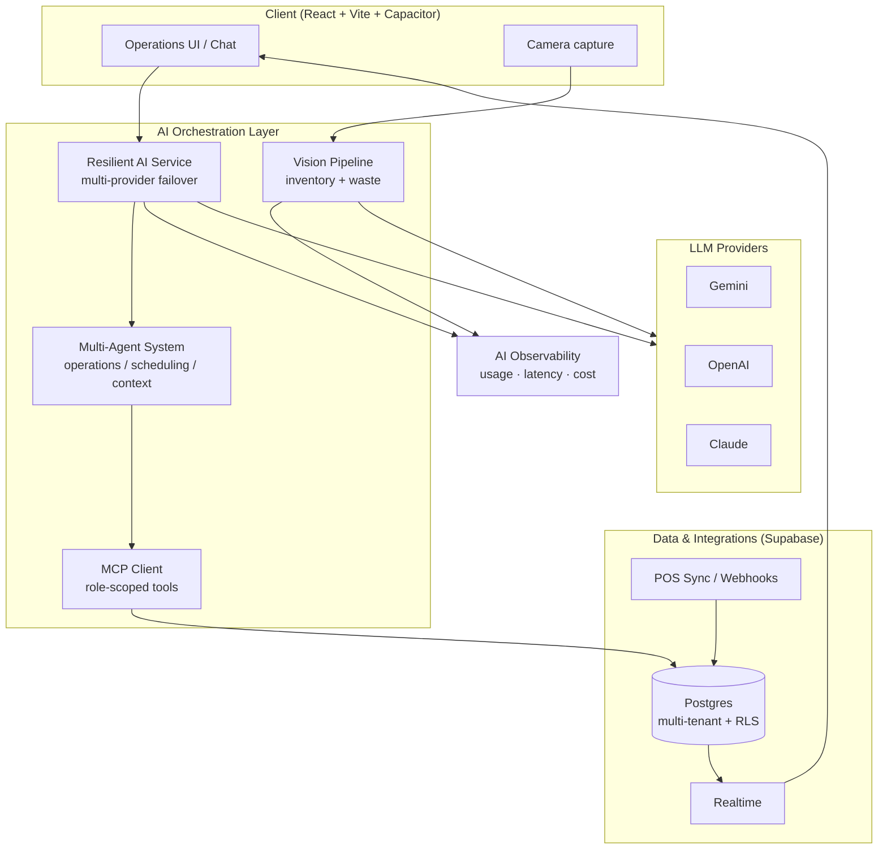

# Nexhost — Restaurant Operations AI Platform (Architecture Case Study)

> A production AI platform for restaurant operations: multi-agent assistants, RAG over
> operational data, a Model Context Protocol (MCP) tool layer, computer-vision inventory
> and waste analysis, and end-to-end AI observability.

**This repository is a sanitized architecture case study, not the production source code.**
It documents the system design, engineering decisions, and AI patterns behind Nexhost.
Proprietary application code, prompts, customer data, schemas, and credentials are intentionally
excluded. Diagrams and examples use synthetic data only.

---

## My role

**Muhammed Salim — AI Engineer (London).**

I led the design and implementation of the AI platform, including:

- The **multi-agent** assistant layer and the **MCP tool** interface to operational data.
- The **resilient multi-provider LLM** layer (failover across Gemini, OpenAI, Claude).
- **Computer-vision** pipelines for inventory counting and waste detection.
- **AI observability** and usage/billing tracking across all model calls.
- Multi-tenant data design on **Supabase/Postgres** and integration with POS systems.

Certifications: **AWS AI Practitioner**, **GCP Generative AI Leader**, **Azure AI Apps & Agent Builder**.

---

## The problem

Independent and multi-site restaurants run on thin margins and fragmented tooling. Stock,
recipes, menu costing, staff scheduling, waste, and sales data live in disconnected systems.
Operators rarely have time to query that data, so insight arrives too late to change a margin.

**Goal:** let a restaurant operator *ask questions in plain language* ("what did we waste this
week and why?", "which menu items are below target margin?", "who's scheduled Friday night?")
and get grounded, actionable answers — plus automate the data capture (e.g. counting stock from
a photo) that makes those answers possible.

---

## What the platform does

| Capability | Description |
|------------|-------------|
| **Conversational operations assistant** | Natural-language Q&A and actions over inventory, menu, staff, waste, and sales. |
| **Multi-agent task execution** | Specialized agents (operations, scheduling, context) call tools to read/update operational data. |
| **MCP tool layer** | A Model Context Protocol interface exposes safe, role-scoped database tools to the LLM. |
| **Computer vision** | Photo-based inventory counting and waste detection with confidence scoring and cost impact. |
| **RAG over operational context** | Retrieval of the relevant slice of restaurant data to ground each answer. |
| **POS integration** | Inventory auto-deduction from synced point-of-sale orders. |
| **AI observability** | Per-call usage, latency, and cost tracking with model-failover health. |

---

## High-level architecture

See [`docs/architecture.md`](docs/architecture.md) for the full breakdown.

---

## Tech stack

- **AI / Agents:** Multi-provider LLMs (Gemini, OpenAI, Claude), Model Context Protocol (MCP),
  function/tool calling, RAG, computer vision.
- **Backend / Data:** Supabase (Postgres, Auth, Realtime, Row-Level Security), multi-tenant schema.
- **Frontend:** React, TypeScript, Vite, Tailwind, shadcn/ui, Capacitor (iOS/Android).
- **Integrations:** POS order sync, payments, CSV/Excel ingestion.
- **Ops:** Environment-based configuration, structured logging, usage/billing metering.

> My broader engineering stack also includes Python, FastAPI, LangChain/LangGraph, FastMCP,
> Docker, and GCP Vertex AI — applied across other projects in my portfolio.

---

## Documentation

| Doc | Contents |
|-----|----------|
| [Architecture](docs/architecture.md) | System components, data flow, request lifecycle. |
| [Agents, RAG & MCP](docs/agents-rag-mcp.md) | Multi-agent design, tool calling, retrieval, MCP layer. |
| [Computer vision](docs/computer-vision.md) | Inventory counting and waste detection pipeline. |
| [Observability](docs/observability.md) | Usage, latency, cost tracking, and model failover health. |
| [Data model](docs/data-model.md) | Multi-tenant design and security patterns (sanitized). |

---

## Engineering decisions & impact

- **Resilience first:** model failover keeps the assistant available when a single provider
  degrades, with health tracking per provider.
- **Safety by design:** the LLM never touches the database directly — all access goes through a
  role-scoped MCP tool layer with Row-Level Security beneath it.
- **Cost visibility:** every AI call is metered (tokens, latency, cost) so AI features stay
  economically viable at scale.
- **Operator-grade UX:** automatic reconnection and realtime sync keep operational data fresh on
  shared devices in busy kitchens.

> Quantitative impact metrics are maintained privately with the company and can be discussed in
> interviews; this public repo focuses on design and patterns rather than business figures.

---

## A note on scope and ownership

Nexhost is a commercial product. This repository:

- Contains **no** production source code, prompts, secrets, or customer data.
- Uses **synthetic** examples and **generic** patterns only.
- Documents architecture and the author's engineering contributions for portfolio purposes.

Live product: see the company site. For implementation details beyond what is documented here,
happy to walk through them directly.

## License

The documentation in this repository is released under
[CC BY 4.0](https://creativecommons.org/licenses/by/4.0/). Any sample code under `examples/` is
released under the MIT License (see [`examples/LICENSE`](examples/LICENSE)).
