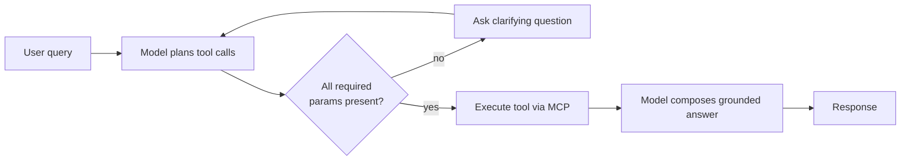
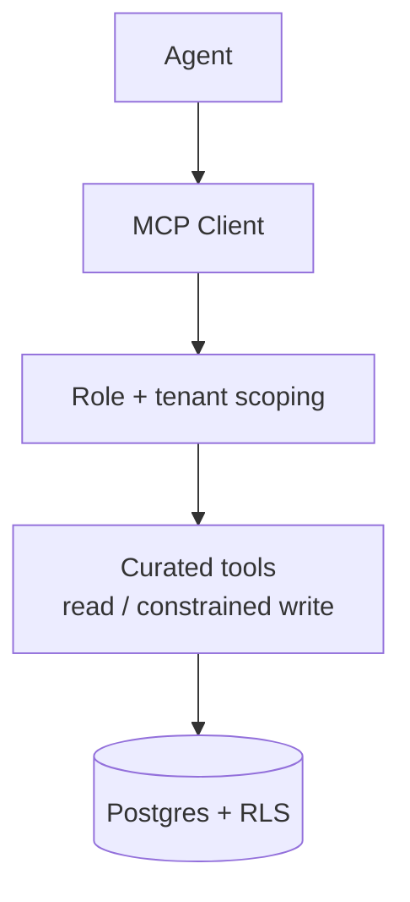

# Agents, RAG & MCP

How the assistant reasons over restaurant operations data. Patterns only — no production prompts.

## Multi-agent design

The assistant is organized as a set of cooperating agents rather than one monolithic prompt.
Each agent owns a domain and a tool set:

| Agent | Responsibility | Example tools |
|-------|----------------|---------------|
| **Operations agent** | Inventory, menu, waste, tasks Q&A and actions | check stock, low-stock list, recipe cost, waste by period |
| **Scheduling agent** | Staff scheduling and coverage | who's working, schedule shift, coverage gaps |
| **Context agent** | Assembles the relevant operational context for a query | fetch tenant context, recent sales, current settings |

A top-level orchestrator selects the agent(s) for a request, gathers the needed context, and
returns a single grounded answer. Agents share a common tool-calling contract so new domains can
be added without changing the orchestration core.

## Tool calling

Agents expose typed functions (tools) to the LLM. The model proposes a tool call with arguments;
the system validates arguments, fills any missing required parameters by asking a follow-up
question, executes the tool, and feeds the structured result back to the model.

Design notes:
- **Parameter tracking:** the agent tracks extracted vs. missing parameters and the relevant
  conversation slice, so multi-turn requests ("schedule her for Friday" → "who is 'her'?") work.
- **Deterministic execution:** tools do the data work; the model only orchestrates and explains.

## Model Context Protocol (MCP) layer

Rather than letting the model emit SQL, the platform exposes a curated MCP tool surface backed by
Postgres (built on the MCP Postgres server pattern plus custom domain tools).

- **Role-scoped:** each session carries a user role (e.g. staff vs. manager); the MCP layer
  restricts which tools and actions are available.
- **Tenant-scoped:** every call is bound to a single restaurant; RLS enforces isolation underneath.
- **Auditable:** the tool boundary is a natural place to log and rate-limit AI-initiated access.

## RAG over operational context

"Retrieval" here means pulling the relevant slice of *operational* data (not just documents) to
ground answers — current stock levels, recent sales, recipes, schedules, settings, and currency
context. The context agent assembles this slice per query so the model reasons over live,
tenant-specific facts rather than its own recall.

This keeps numeric answers (costs, margins, waste totals) tied to real data, which is essential
when an operator will act on them.

## Why multi-agent + MCP instead of one big prompt

- **Smaller, safer surfaces:** each agent has a narrow tool set, reducing the blast radius of a
  bad tool call.
- **Maintainability:** domains evolve independently; adding "purchasing" doesn't destabilize
  "scheduling".
- **Security:** the MCP boundary is the single, auditable place to enforce role and tenant rules.
