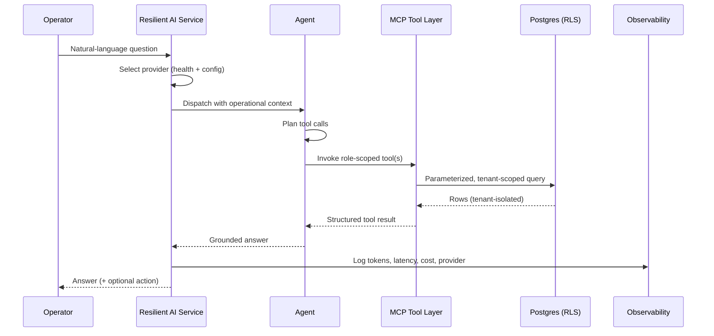

# Architecture

This document describes the system design of the Nexhost restaurant operations AI platform.
It is a sanitized overview — no production code, prompts, schemas, or secrets are included.

## Components

### 1. Client layer
- React + TypeScript single-page app built with Vite and shadcn/ui.
- Packaged for web and native mobile via Capacitor (iOS/Android), including camera access for
  vision features.
- A conversational interface (text and voice) sits alongside traditional dashboards for
  inventory, menu costing, staff, waste, and analytics.
- Connection management: detects tab visibility / network changes and refreshes auth and
  realtime subscriptions so shared kitchen devices always show current data.

### 2. AI orchestration layer
The core of the platform. Four cooperating concerns:

- **Resilient AI Service** — a provider-agnostic entry point that routes a request to the best
  available LLM and fails over automatically (see [observability](observability.md)).
- **Multi-agent system** — specialized agents for operations Q&A/actions, staff scheduling, and
  context-aware reasoning. See [agents-rag-mcp](agents-rag-mcp.md).
- **MCP client** — a Model Context Protocol interface that exposes safe, role-scoped database
  tools to the model instead of raw SQL.
- **Vision pipeline** — multi-pass image analysis for inventory counts and waste detection.

### 3. LLM providers
Pluggable providers (Gemini, OpenAI, Claude). Provider selection is configuration-driven and
keyed off available credentials and live health status, never hardcoded.

### 4. Data & integrations
- **Supabase / Postgres** as the system of record, with Row-Level Security and a multi-tenant
  (multi-restaurant) schema.
- **Realtime** subscriptions push updates to clients.
- **POS sync** ingests orders (webhook or batch import) and triggers inventory deduction.
- **Ingestion** of historical sales via CSV/Excel.

### 5. Observability
Every model call is metered for usage, latency, and cost, and provider health is tracked to
inform failover. See [observability](observability.md).

## Request lifecycle (assistant query)

## Key design principles

1. **The model never touches the database directly.** All data access is mediated by the MCP
   tool layer, which enforces role and tenant scope; RLS provides defense in depth.
2. **Provider independence.** The orchestration layer treats LLMs as interchangeable, enabling
   failover and cost/quality tuning without code changes.
3. **Ground every answer.** Responses are built from retrieved operational data, not model
   recall, reducing hallucination on business-critical numbers.
4. **Measure everything.** AI is a recurring cost; per-call metering keeps features viable.
5. **Multi-tenant by default.** Every query is scoped to a single restaurant/tenant.

## Why these choices

- **Supabase** gave Postgres, auth, realtime, and RLS in one managed platform, reducing ops
  overhead for a small team while keeping standard SQL portability.
- **MCP** provided a clean, auditable boundary between the LLM and data, which is far safer than
  letting a model generate SQL directly.
- **Capacitor** let one TypeScript/React codebase ship to web, iOS, and Android — important for
  in-kitchen mobile use without a separate native team.
