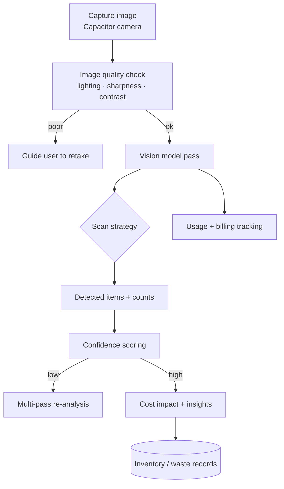

# Computer Vision

Photo-based inventory counting and waste detection. Patterns and design only — no production
models, prompts, or client imagery.

## Goal

Manual stock and waste logging is slow and error-prone, so it often doesn't happen. The vision
pipeline lets staff photograph a shelf, fridge, or waste bin and get a structured, costed result
that flows straight into inventory and waste records.

## Pipeline

## Scan strategies

The pipeline supports configurable strategies so the same capture flow serves different needs:

| Strategy | Optimized for |
|----------|---------------|
| `fast` | Quick counts during service |
| `comprehensive` | Thorough end-of-day stocktake |
| `precision` | High-value items where accuracy matters most |
| `supplier_analysis` | Correlating waste/spoilage with suppliers |

Each strategy tunes confidence thresholds, retry behavior, and focus areas (e.g. spoilage,
expiration, damage, contamination).

## Quality gating

Before trusting a detection, the pipeline scores image quality (lighting, sharpness, contrast,
subject visibility). Poor inputs prompt the user to retake rather than producing unreliable
counts — important because downstream numbers drive ordering and cost decisions.

## Waste-specific intelligence

For waste captures, results include:
- Itemized waste with estimated **cost impact**.
- **Reason** breakdown (spoilage, over-prep, damage) and counts.
- **Supplier correlation** to surface recurring quality issues.
- **Prevention suggestions** and an overall **risk score**.

## From pixels to records

Detected items are reconciled against the tenant's catalog so a photo updates the *same*
inventory and waste tables the rest of the platform uses — no parallel data silo. Every vision
call is metered for usage and cost (see [observability](observability.md)).

## Design notes

- **Vision as a tool, not a black box:** outputs are structured (items, quantities, confidence,
  cost) so they can be validated, edited, and audited before they affect stock.
- **Human-in-the-loop:** low-confidence results surface for confirmation rather than silently
  writing data.
- **Cost-aware:** vision calls are among the more expensive AI operations, so they are explicitly
  metered and gated by quality checks to avoid wasted spend.
