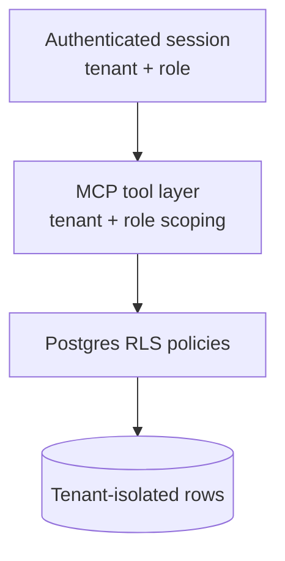

# Data Model & Security (Sanitized)

A high-level view of the data design. **No production schema, column names, tenant data, or
migrations are included** — this describes patterns only.

## Multi-tenancy

The platform serves many restaurants from one database using a **multi-tenant** design:

- Every operational row is associated with a restaurant/tenant.
- **Row-Level Security (RLS)** policies ensure a session can only read/write its own tenant's
  data, enforced by the database rather than application code alone.
- The MCP tool layer additionally scopes every query to the active tenant, providing defense in
  depth.

## Domains (conceptual)

The data model covers the operational domains an assistant needs to answer real questions:

- **Inventory & stock** — items, quantities, suppliers, expiry.
- **Recipes & menu** — ingredients, yields, costing.
- **Staff & scheduling** — roles, shifts, coverage.
- **Waste** — logged waste with reasons and cost impact.
- **Sales** — orders synced from POS and imported history.
- **AI usage / billing** — metering records for model calls.

## Costing logic

The platform implements standard hospitality costing (yield %, cost per servable unit, total
recipe cost with quality factors, yield variance) consistently across features so that AI answers
about margin and cost match the rest of the system. These formulas are industry-standard; the
proprietary value is in how they're integrated, not the formulas themselves.

## Security principles

1. **Database-enforced isolation** via RLS — not just app-layer checks.
2. **Least privilege** at the tool layer — roles gate which tools and actions exist.
3. **No raw SQL from the model** — the LLM only calls curated, parameterized tools.
4. **Secrets via environment** — no credentials in code or config committed to source control
   (see [`.env.example`](../.env.example)).
