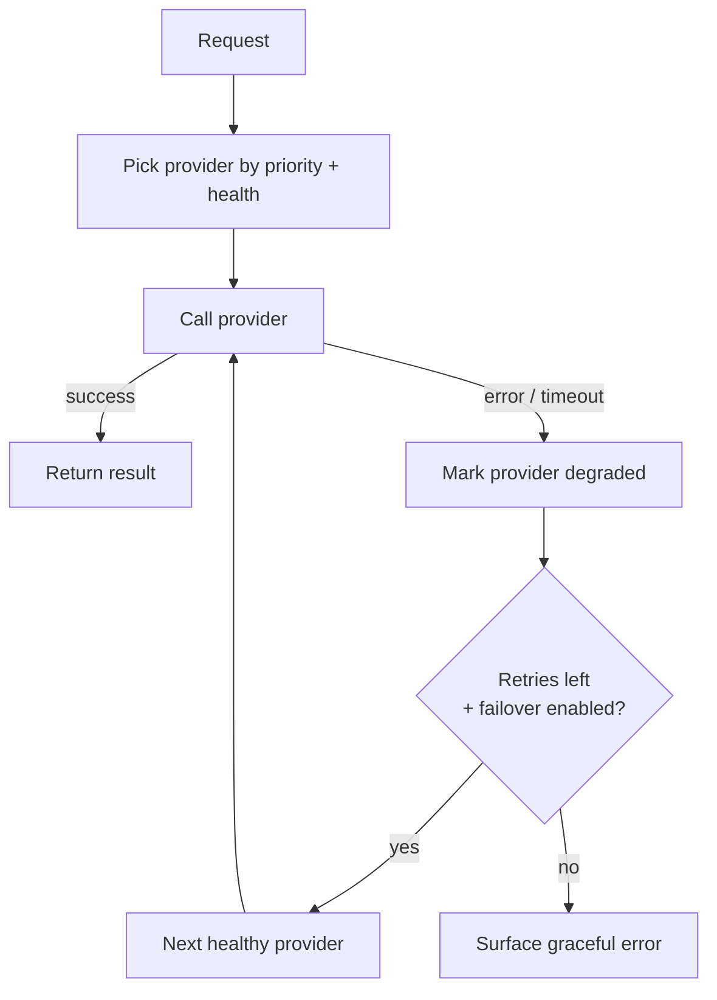

# AI Observability & Resilience

Running LLM features in production means treating them as a metered, fallible dependency. This
document covers how the platform stays available and keeps AI economically viable. Patterns only.

## Multi-provider failover

The Resilient AI Service treats LLM providers as interchangeable and routes around failures.

- **Priority order** with configurable failover list (e.g. Gemini → OpenAI → Claude).
- **Per-provider health**: availability, error count, last error, last success time, response
  time.
- **Bounded retries** with delay and request timeout to avoid hanging the UI.
- **Graceful degradation**: if all providers fail, the user gets a clear message, not a crash.

## What gets measured

Each AI operation records:

| Metric | Why it matters |
|--------|----------------|
| Tokens / units | Drives cost; detects runaway prompts |
| Latency | UX and provider-health signal for failover |
| Cost | Keeps per-feature economics visible |
| Provider + model | Attribute spend and quality per provider |
| Operation type | e.g. chat vs. vision (vision is costlier) |
| Success / failure | Feeds provider health and alerting |

Vision and chat operations are tracked through a common metering path so usage and billing can be
aggregated per tenant and per feature.

## Why this matters

- **Availability:** a single provider outage or rate-limit no longer takes the assistant down.
- **Cost control:** AI is a recurring, usage-based cost; without metering, a few heavy users or a
  bad prompt can quietly erode margin.
- **Quality tuning:** latency and error data per provider inform which model to prefer for which
  operation.
- **Trust:** transparent metering supports fair, usage-based billing for AI features.

## Design notes

- Metering is **non-blocking** — logging a call's metrics never delays the user's response.
- Health state is **in-memory and fast** so failover decisions add negligible latency.
- The same observability path covers both text and vision, avoiding blind spots in the most
  expensive operations.
